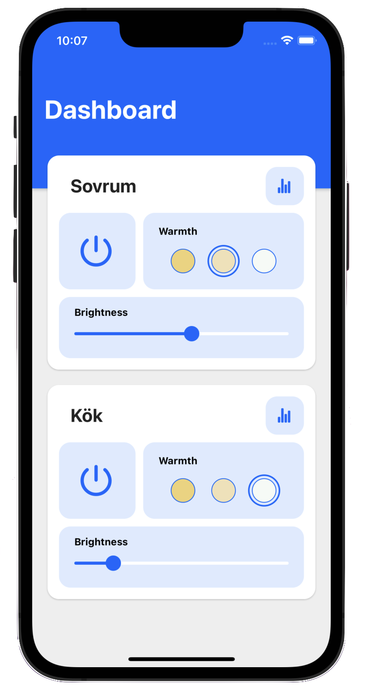
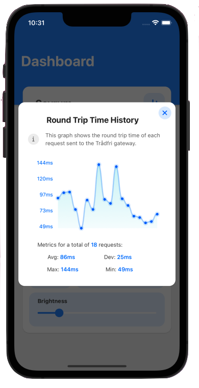
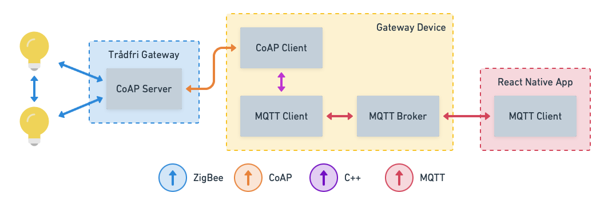
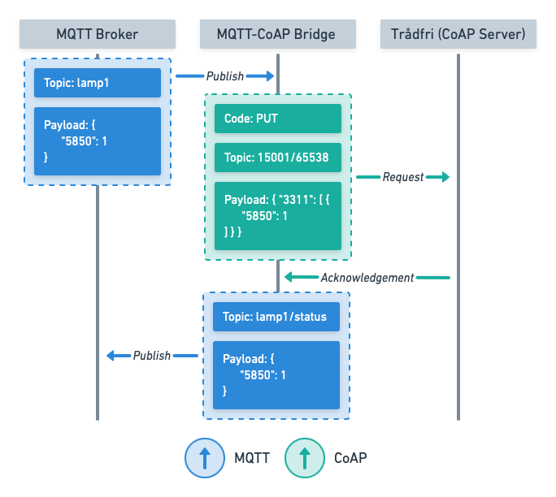

# Project 3 - Combined IoT system

Combining project 1 and 2 into an IoT system an integrating it with Ikeas Trådfri gateway

## Frontend Application

  
   

## System architecture

## Bridging MQTT to CoAP

